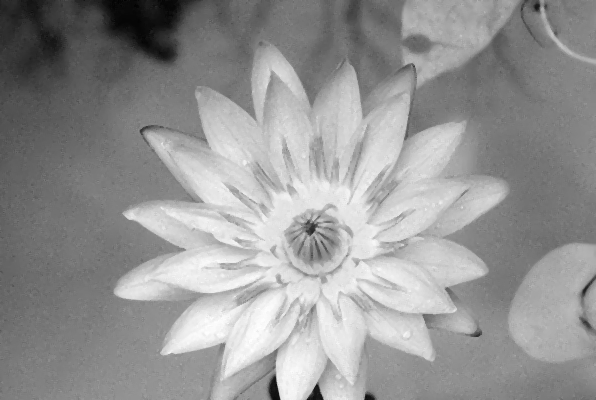

# Salt and Pepper for CUDA

## Overview

Salt and Pepper algorith for CUDA. For work with images, program uses EasyBMP.

## How use

1. Create executable program

    ```console
    make salt_and_pepper
    ```

2. Run

    ```console
    ./salt_and_pepper
    ```

## System configuration

Intel Xeon 1650v3 and NVIDIA GTX 1060.

## Results

Image input:


Image output:


